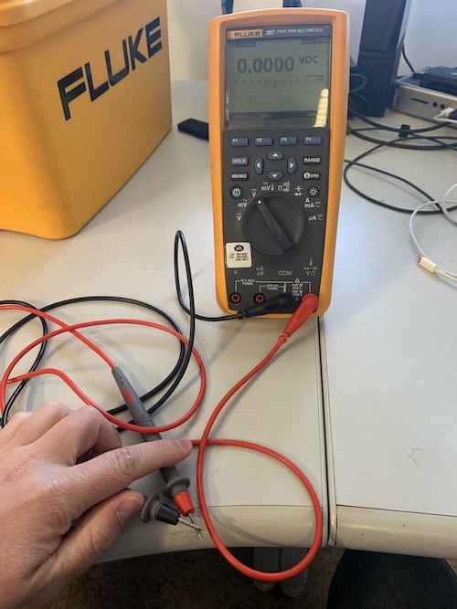
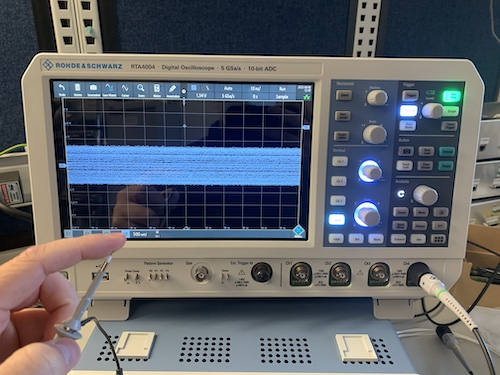
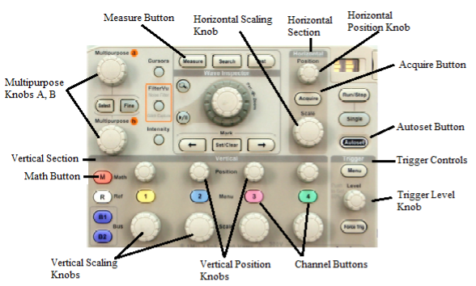

# ASSURE REU 2022: 
# Electronics Workshop
Scott Candey

2022-06-08
Version 1

---

## Overview

- Electronics for space science
- Balloon projects ([COSI](https://cosi.ssl.berkeley.edu/))
- What is a microcontroller
- How do we debug electronics 
- Using microcontroller
- Making our own balloon experiment


---

## Microcontroller

- RP2040 microcontroller from Adafruit
- Programming it with CircuitPython
- One task at a time looping forever, unlike a computer or phone
- Interacts with the world easily


---

## Tools for electronics debugging
How to tell what is happening at this moment? Digital multimeter!


- Black probe is ground, reference point for voltage
- Red probe is measurement

---

### Using digital multimeter

- Black probe always touches the GND pin on the top left
- Try touching red probe to 3.3V, VBAT/BAT, and VBUS/USB
- What voltages do you measure for each?


---
## Tools for electronics debugging
How to tell what is happening over time? Oscilloscope!
- Clip hanging off the probe is ground
- Tip of probe is measurement



--- 

 

---
### Using oscilloscope

- Clip to wire from GND
- Probe D13
- Autoset to see waveform
  


---
## Programming the microcontroller

Using the wonderful tutorials from Adafruit:
- [Install the Mu editor](https://learn.adafruit.com/adafruit-feather-rp2040-pico/installing-mu-editor)
- Write "Hello World" equivalent: [Blinky](https://learn.adafruit.com/welcome-to-circuitpython/creating-and-editing-code)
- Talk to the board with the [serial console](https://learn.adafruit.com/welcome-to-circuitpython/kattni-connecting-to-the-serial-console)
- Program the microcontroller "live" using [REPL](https://learn.adafruit.com/welcome-to-circuitpython/the-repl)

---
## Files
- `code.py` includes main loop, mostly editing this
- `boot.py` runs on startup
- `lib` contains libraries for talking to sensors

---
## Sensors 

- BME680 is a temperature, pressure, humidity, and gas sensor
- LSM6DSO32 is an accelerometer and gyrometer

Plug in both in a chain, then copy code from repository to microcontroller to get measurements from them printed out on the screen


---
## Flash memory oddities

We want to save our measurements to the internal flash memory, like a flash drive

- Can't use flash with computer and with code at the same time
- `boot.py` sets up code access, stops computer access
- remove `boot.py` with REPL over serial
- reset button reloads microcontroller

```
import os; os.remove("boot.py")
```

--- 

## Setting up the balloon experiment!

- Copy measurement logging code to microprocessor, including `boot.py`
- Press reset button to reload `boot.py` so that code can use the flash
- Take data for a few seconds, then open serial monitor and remove `boot.py` with `import os; os.remove("boot.py")`
- Press reset button to return control to the computer
- Open `measurements.csv` and check that you see various values
- Delete `measurements.csv` and copy `boot.py` back onto the microprocessor

---

## Assembly of balloon experiment

- Disconnect microcontroller from computer, leave battery attached
- Kapton tape microcontroller, sensors, and battery into a bundle ("payload") with a loop for attaching string
- Fill up balloon and attach to string
- Tie knot in string through payload loop 
- Bring payload and balloon outside
---

## Running balloon experiment
- Countdown!
- Right before launch, press reset button
- Slowly release string to allow balloon to ascend
- Mark down important times in seconds from pressing reset
  - Try pulling string up and down sharply
  - Hover at various altitudes
- Return to Earth
- Bring payload and balloon back inside for analysis
- Dismantle payload

---
## Data analysis
- Connect microcontroller to computer, open serial monitor
- Delete `boot.py` with instructions from earlier
- Press reset button to return control to computer
- Copy `measurements.csv` to a safe place on your computer
- Disconnect microcontroller from computer, put aside
- Open jupyter notebook using Anaconda
- Make graphs of time vs. our various measurements
  - Experiment with various types of graph or combined measurements on one graph
